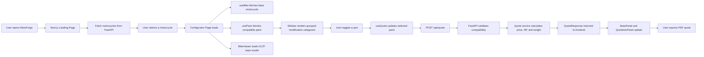

# MotoForge

MotoForge is a full-stack 3D motorcycle modification configurator that lets users preview a motorcycle build before buying parts or starting fabrication. The app combines a Next.js frontend, a FastAPI backend, real-time quote logic, and a 3D viewer powered by Three.js.

## Overview

MotoForge is designed for builders, riders, and custom shops that want to:

- Start from a supported base motorcycle.
- Browse only compatible modification parts.
- View modifications in a 3D interactive configurator.
- See real-time horsepower, weight, and pricing changes.
- Export a professional quotation for the selected build.

The repository is structured as a monorepo with separate frontend and backend apps plus infrastructure and CI/CD assets.

## Core Features

- 3D motorcycle viewer with orbit controls, lighting, reflections, and mod overlays.
- Compatibility-aware parts catalog grouped by category.
- Real-time quote calculation using backend business logic.
- Performance summary for horsepower and weight changes.
- PDF quotation export for selected builds.
- Docker, Kubernetes, Cloud Run, and Vercel deployment support.
- GitHub Actions CI for linting, testing, and build verification.

## Tech Stack

### Frontend

- Next.js 14 with App Router
- React 18
- Tailwind CSS
- Axios
- jsPDF and `jspdf-autotable`

### 3D Layer

- Three.js
- `@react-three/fiber`
- `@react-three/drei`
- `@react-spring/three`

### Backend

- FastAPI
- SQLAlchemy
- Pydantic Settings
- SQLite for MVP
- Uvicorn

### DevOps and Infrastructure

- Docker
- Docker Compose
- GitHub Actions
- Google Cloud Run
- Google Kubernetes Engine
- Vercel
- Turborepo

## Architecture

MotoForge is split into two primary applications:

- `apps/web`: the user-facing configurator and landing experience.
- `apps/api`: the catalog, compatibility, quote, and seed/data layer.

The frontend talks to the backend over HTTP. The backend reads motorcycle and part data from SQLite and calculates quotes based on selected compatible parts.

## End-to-End Flowchart



## Request and Data Flow

### Landing Page

1. The Next.js home page calls `GET /api/motorcycles`.
2. The backend returns a list of supported motorcycles.
3. The user selects a bike and navigates to `/configurator/[bikeId]`.

### Configurator Page

1. `useBike(bikeId)` fetches the base motorcycle.
2. `useParts(bikeId)` fetches compatible modifications grouped by category.
3. `BikeViewer` renders the base GLTF model.
4. The sidebar shows available parts, performance metrics, and quotation details.

### Quote Calculation

1. The user selects or removes a part.
2. `useQuote` updates `selectedParts`.
3. `POST /api/quote` sends the selected part IDs.
4. The backend validates compatibility against the selected motorcycle.
5. The backend computes:
   - base bike price + parts subtotal
   - new horsepower
   - new weight
   - HP gain
   - weight delta
6. The frontend updates the stats and quotation panels immediately.

### PDF Export

1. The user clicks `Generate PDF Quote`.
2. The frontend uses `generateQuotePDF(...)`.
3. The selected parts and totals are exported into a downloadable quote.

## Folder Structure

```text
motoforge/
├── .github/
│   └── workflows/
│       ├── ci.yml
│       └── deploy.yml
├── apps/
│   ├── api/
│   │   ├── app/
│   │   │   ├── models/
│   │   │   ├── routers/
│   │   │   ├── schemas/
│   │   │   ├── services/
│   │   │   ├── utils/
│   │   │   ├── config.py
│   │   │   ├── database.py
│   │   │   └── main.py
│   │   ├── seed/
│   │   ├── tests/
│   │   ├── Dockerfile
│   │   └── requirements.txt
│   └── web/
│       ├── app/
│       ├── components/
│       │   ├── performance/
│       │   ├── quotation/
│       │   ├── sidebar/
│       │   ├── ui/
│       │   └── viewer/
│       ├── hooks/
│       ├── lib/
│       ├── styles/
│       ├── Dockerfile
│       ├── next.config.js
│       ├── package.json
│       └── tailwind.config.js
├── infra/
│   ├── docker-compose.yml
│   └── k8s/
│       ├── api-deployment.yaml
│       ├── ingress.yaml
│       └── web-deployment.yaml
├── turbo.json
└── README.md
```

## Local Setup

### Prerequisites

- Python 3.11+
- Node.js 20+
- npm
- Docker Desktop optional

### Run Without Docker

#### 1. Backend setup

```bash
cd apps/api
python -m venv .venv
source .venv/bin/activate
pip install -r requirements.txt
uvicorn app.main:app --reload
```

On Windows PowerShell:

```powershell
cd apps/api
python -m venv .venv
.venv\Scripts\Activate.ps1
pip install -r requirements.txt
uvicorn app.main:app --reload
```

#### 2. Frontend setup

```bash
cd apps/web
npm install
npm run dev
```

#### 3. Open the app

- Frontend: `http://localhost:3000`
- Backend: `http://localhost:8000`
- API docs: `http://localhost:8000/docs`

## Docker Setup

From the `infra/` directory:

```bash
docker compose up --build
```

This starts:

- FastAPI API on port `8000`
- Next.js frontend on port `3000`

## Environment Variables

### Frontend

`apps/web/.env.local`

```env
NEXT_PUBLIC_API_URL=http://localhost:8000
```

### Backend

Optional `apps/api/.env`

```env
DATABASE_URL=sqlite:///./motoforge.db
CORS_ORIGINS=["http://localhost:3000"]
APP_ENV=development
```

## Seeding the Database

Seed the default MotoForge catalog:

```bash
cd apps/api
python seed/seed.py
```

Seeded data currently includes:

- Benelli 502C
- GPR Deeptone Exhaust
- Ohlins Rear Shock
- Excel Takasago Wheels
- Carbon Fibre Fairing Kit
- Rizoma Bar End Mirrors + Handlebars

## Running Tests

### Backend tests

```bash
cd apps/api
python -m pytest tests/test_quotes.py
```

### Frontend build verification

```bash
cd apps/web
npm run build
```

### CI checks

GitHub Actions runs:

- API formatting and lint checks with `black` and `flake8`
- API tests with `pytest`
- Web linting
- Web production build

## CI/CD

### CI Workflow

`.github/workflows/ci.yml` runs on:

- push to any branch
- pull request targeting `main`

It validates:

- API style and formatting
- API tests
- Frontend linting
- Frontend build success

### Deployment Workflow

`.github/workflows/deploy.yml` runs on pushes to `main`.

It performs:

- API Docker build and push to Google Artifact Registry
- API deployment to Cloud Run in `us-central1`
- Frontend production build
- Frontend deployment to Vercel

Required GitHub secrets include:

- `GCP_SA_KEY`
- `NEXT_PUBLIC_API_URL`
- `VERCEL_TOKEN`
- `VERCEL_ORG_ID`
- `VERCEL_PROJECT_ID`

## Deployment to GCP

### Cloud Run API

The API deploy pipeline builds `apps/api/Dockerfile`, pushes the image to Artifact Registry, and deploys the service as:

- service name: `motoforge-api`
- region: `us-central1`

### GKE Option

Kubernetes manifests are included in `infra/k8s/` for:

- API deployment and service
- Web deployment and service
- Ingress routing

Ingress rules route:

- `/api/*` to the FastAPI service
- `/*` to the Next.js service

### Vercel Frontend

The web deployment job builds the app and deploys it to Vercel. In production, `NEXT_PUBLIC_API_URL` should point to the deployed API endpoint.

## Build and Monorepo Commands

Turborepo configuration is defined in `turbo.json`.

Example commands:

```bash
npx turbo run build
npx turbo run lint
npx turbo run test
```

## Development Notes

- SQLite is used for MVP simplicity. For production, move to Cloud SQL or another managed relational database.
- The quote flow is backend-driven, so compatibility and pricing rules stay authoritative.
- GLTF and GLB model paths are expected to come from the backend catalog.
- Real asset drop-in targets now live under `apps/web/public/models/` with a
  concrete manifest at `apps/web/public/models/asset-manifest.json`.
- Keep the current placeholder URLs in the seed data until the matching `.glb`
  assets have been added locally and validated in the viewer.
- Local `.env.local`, database files, and generated caches should not be committed.

## Contributing

1. Create a feature branch from `main`.
2. Keep changes scoped to a clear feature or fix.
3. Run backend tests before opening a pull request.
4. Run frontend build checks for UI-affecting work.
5. Update docs when setup, deployment, or architecture changes.
6. Avoid committing secrets, local env files, or generated cache artifacts.

## Roadmap Ideas

- Authentication and saved builds in a real user account system
- Build comparison mode
- More motorcycles and part categories
- Dealer-ready branded quote templates
- Persistent 3D model asset pipeline
- Production-grade PostgreSQL support

## License

Add a project license file before open-sourcing or commercial distribution.
